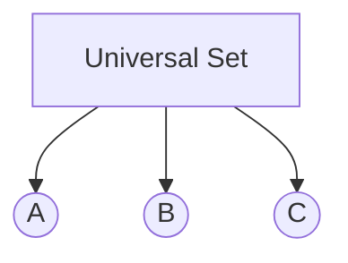

# Principle of Inclusion and Exclusion (PIE)

> **Course:** Discrete Structures  
> **Unit:** 1 – Set Theory and Logic

---

## Table of Contents

- [Learning Objectives](#learning-objectives)
- [Introduction](#introduction)
- [Why Do We Need PIE?](#why-do-we-need-pie)
- [Principle of Inclusion and Exclusion](#principle-of-inclusion-and-exclusion)
- [Formula for Two Sets](#formula-for-two-sets)
- [Formula for Three Sets](#formula-for-three-sets)
- [Venn Diagram](#venn-diagram)
- [Solved Examples](#solved-examples)
- [Applications](#applications)
- [Exam Tips](#exam-tips)
- [Common Mistakes](#common-mistakes)
- [Practice Questions](#practice-questions)
- [Summary](#summary)

---

# Learning Objectives

After studying this chapter, you should be able to:

- Understand the Principle of Inclusion and Exclusion (PIE).
- Apply PIE to two-set problems.
- Apply PIE to three-set problems.
- Solve counting problems involving overlapping sets.
- Interpret Venn diagrams correctly.
- Avoid double-counting elements.

---

# Introduction

When two or more sets overlap, simply adding their sizes counts the common elements more than once.

The **Principle of Inclusion and Exclusion (PIE)** provides a systematic way to count the total number of distinct elements by correcting this overcounting.

This principle is widely used in:

- Set Theory
- Probability
- Combinatorics
- Database systems
- Computer Science
- Competitive programming

---

# Why Do We Need PIE?

Suppose:

```text
A = {1,2,3,4}

B = {3,4,5,6}
```

If we calculate:

```text
|A| + |B|

= 4 + 4

= 8
```

This is incorrect because the elements **3** and **4** are counted twice.

To correct this, subtract the intersection.

---

# Principle of Inclusion and Exclusion

The principle states:

> To find the total number of distinct elements in overlapping sets, add the sizes of the individual sets and subtract the sizes of their intersections.

---

# Formula for Two Sets

For two finite sets **A** and **B**:

$$
|A \cup B| = |A| + |B| - |A \cap B|
$$

Where:

- `|A|` = Number of elements in A
- `|B|` = Number of elements in B
- `|A ∩ B|` = Number of common elements

---

# Example

Given:

```text
|A| = 25

|B| = 18

|A ∩ B| = 10
```

Find:

```text
|A ∪ B|
```

### Solution

$$
|A \cup B| = 25 + 18 - 10
$$

$$
= 33
$$

---

# Formula for Three Sets

For three sets **A**, **B**, and **C**:

$$
|A \cup B \cup C|
=
|A|
+
|B|
+
|C|
-
|A \cap B|
-
|A \cap C|
-
|B \cap C|
+
|A \cap B \cap C|
$$

Notice the pattern:

- Add individual sets.
- Subtract pairwise intersections.
- Add the triple intersection.

---

# Venn Diagram



> **Note:** In exams, Venn diagrams are usually drawn with overlapping circles. Mermaid cannot perfectly represent overlapping circles, so draw the traditional Venn diagram by hand when answering written exams.

---

# Solved Examples

## Example 1

In a class:

- 40 students study Mathematics.
- 30 students study Physics.
- 12 students study both.

Find the number of students studying at least one subject.

### Solution

Given:

```text
|M| = 40

|P| = 30

|M ∩ P| = 12
```

Using PIE:

$$
|M \cup P|
=
40
+
30
-
12
$$

$$
=58
$$

**Answer:** 58 students.

---

## Example 2

In a survey:

- 45 like Tea.
- 35 like Coffee.
- 15 like both.

Find the number of people who like at least one beverage.

### Solution

$$
45 + 35 - 15 = 65
$$

**Answer:** 65 people.

---

## Example 3 (Three Sets)

Given:

```text
|A| = 20

|B| = 18

|C| = 16

|A ∩ B| = 6

|A ∩ C| = 4

|B ∩ C| = 5

|A ∩ B ∩ C| = 2
```

Find:

```text
|A ∪ B ∪ C|
```

### Solution

$$
20 + 18 + 16 - 6 - 4 - 5 + 2
$$

$$
=41
$$

---

# Applications

The Principle of Inclusion and Exclusion is used in:

- Counting problems
- Probability
- Database queries
- Survey analysis
- Network security
- Data science
- Competitive programming

---

# Exam Tips

- Memorize the formulas for **two** and **three** sets.
- Always subtract the intersection for two sets.
- For three sets:
  - Add individual sets.
  - Subtract pairwise intersections.
  - Add the triple intersection.
- Draw a Venn diagram before solving word problems.

---

# Common Mistakes

❌ Forgetting to subtract the intersection.

Wrong:

$$
|A \cup B|
=
|A|
+
|B|
$$

Correct:

$$
|A \cup B|
=
|A|
+
|B|
-
|A \cap B|
$$

---

❌ Forgetting to add the triple intersection in three-set problems.

Remember:

```text
+ Triple Intersection
```

is always added back.

---

❌ Mixing union and intersection.

Remember:

- Union → At least one set.
- Intersection → Common elements.

---

# Practice Questions

## Theory

1. State the Principle of Inclusion and Exclusion.
2. Why is the intersection subtracted?
3. Write the formula for three sets.

---

## Problems

1. If

```text
|A| = 35

|B| = 28

|A ∩ B| = 9
```

Find `|A ∪ B|`.

---

2. In a survey:

- 60 people like Cricket.
- 45 like Football.
- 20 like both.

Find the number of people who like at least one game.

---

3. Solve a three-set problem using the Principle of Inclusion and Exclusion.

---

# Summary

- The Principle of Inclusion and Exclusion prevents double-counting.
- For two sets:

$$
|A \cup B|
=
|A|
+
|B|
-
|A \cap B|
$$

- For three sets:

$$
|A \cup B \cup C|
=
|A|
+
|B|
+
|C|
-
|A \cap B|
-
|A \cap C|
-
|B \cap C|
+
|A \cap B \cap C|
$$

- The principle is widely used in mathematics, probability, and computer science.

---

## Next Topic

➡️ **04 – Computer Representation of Sets**