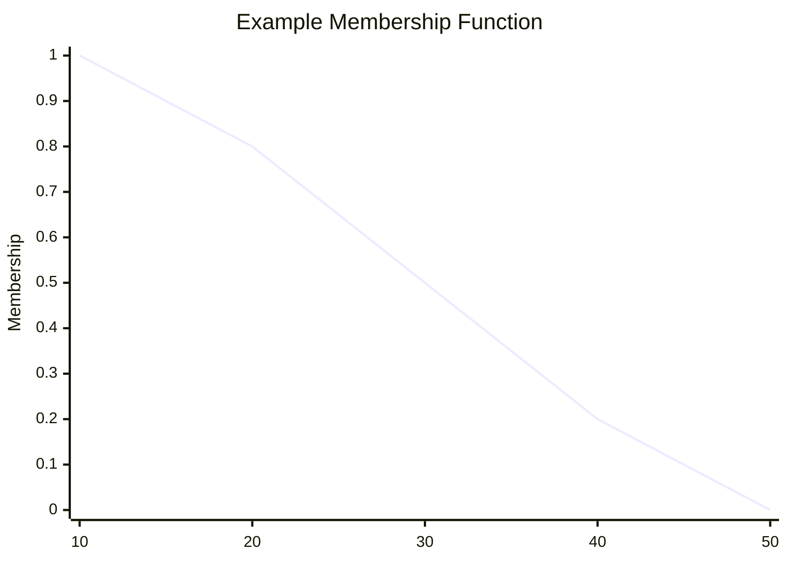

# Fuzzy Sets

> **Course:** Discrete Structures  
> **Unit:** 1 – Set Theory and Logic

---

## Table of Contents

- [Learning Objectives](#learning-objectives)
- [Introduction](#introduction)
- [Limitations of Classical Sets](#limitations-of-classical-sets)
- [What is a Fuzzy Set?](#what-is-a-fuzzy-set)
- [Membership Function](#membership-function)
- [Representation of Fuzzy Sets](#representation-of-fuzzy-sets)
- [Operations on Fuzzy Sets](#operations-on-fuzzy-sets)
- [Examples](#examples)
- [Applications](#applications)
- [Advantages and Limitations](#advantages-and-limitations)
- [Exam Tips](#exam-tips)
- [Common Mistakes](#common-mistakes)
- [Practice Questions](#practice-questions)
- [Summary](#summary)

---

# Learning Objectives

After studying this chapter, you should be able to:

- Understand the concept of fuzzy sets.
- Differentiate between classical and fuzzy sets.
- Define a membership function.
- Represent fuzzy sets mathematically.
- Perform basic operations on fuzzy sets.
- Explain real-world applications of fuzzy sets.

---

# Introduction

In classical (crisp) set theory, an element either **belongs** to a set or **does not belong** to it.

For example,

```text
Tall People = {people taller than 180 cm}
```

A person who is **179 cm** tall is completely excluded, while a person who is **180 cm** tall is fully included.

However, many real-world concepts such as **tall**, **hot**, **fast**, **young**, or **expensive** do not have clear boundaries.

To handle such uncertainty, **Fuzzy Set Theory** was introduced by **Lotfi A. Zadeh** in 1965.

In a fuzzy set, an element can belong to a set **partially**, with a membership value between **0 and 1**.

---

# Limitations of Classical Sets

In a classical set:

- Membership is either **0** or **1**.
- No partial membership is allowed.
- Suitable for precise information only.

Example

```text
Adult = {Age ≥ 18}
```

A person aged **17 years 11 months** is considered **not an adult**, even though they are very close.

This rigid classification motivates the use of fuzzy sets.

---

# What is a Fuzzy Set?

A **fuzzy set** is a set in which each element has a **degree of membership**.

Instead of only two possibilities (0 or 1), the membership value can be any real number between **0 and 1**.

Mathematically,

$$
A=\{(x,\mu_A(x)) \mid x \in U\}
$$

where:

- \(U\) = Universal set
- \(x\) = Element
- \(\mu_A(x)\) = Membership function of \(x\) in set \(A\)

The membership value satisfies:

$$
0 \le \mu_A(x) \le 1
$$

---

# Membership Function

A **membership function** assigns a membership value to each element.

Notation:

$$
\mu_A(x)
$$

Interpretation:

| Membership Value | Meaning |
|-----------------:|---------|
| 0 | Not a member |
| 0.25 | Slightly belongs |
| 0.5 | Partially belongs |
| 0.75 | Mostly belongs |
| 1 | Fully belongs |

---

# Representation of Fuzzy Sets

Example:

Let

```text
U = {10,20,30,40,50}
```

represent people's ages.

Suppose

```text
Young
```

is defined as:

| Age | Membership |
|----:|-----------:|
| 10 | 1.0 |
| 20 | 0.8 |
| 30 | 0.5 |
| 40 | 0.2 |
| 50 | 0.0 |

Then the fuzzy set is written as:

```text
Young = {

(10,1.0),

(20,0.8),

(30,0.5),

(40,0.2),

(50,0.0)

}
```

---

# Membership Function Graph



This graph shows that as age increases, the degree of belonging to the set **Young** decreases.

---

# Operations on Fuzzy Sets

Suppose:

$$
\mu_A(x)=0.6
$$

$$
\mu_B(x)=0.8
$$

## Union

The union of two fuzzy sets is the **maximum** of their membership values.

Formula:

$$
\mu_{A\cup B}(x)
=
\max(\mu_A(x),\mu_B(x))
$$

Example:

$$
\max(0.6,0.8)=0.8
$$

---

## Intersection

The intersection is the **minimum** of the membership values.

Formula:

$$
\mu_{A\cap B}(x)
=
\min(\mu_A(x),\mu_B(x))
$$

Example:

$$
\min(0.6,0.8)=0.6
$$

---

## Complement

The complement is calculated as:

$$
\mu_{A'}(x)
=
1-\mu_A(x)
$$

Example:

If

$$
\mu_A(x)=0.7
$$

then

$$
\mu_{A'}(x)=0.3
$$

---

# Difference Between Classical and Fuzzy Sets

| Classical Set | Fuzzy Set |
|---------------|-----------|
| Membership is either 0 or 1 | Membership ranges from 0 to 1 |
| Sharp boundaries | Gradual boundaries |
| Exact classification | Partial classification |
| Suitable for precise data | Suitable for uncertain or vague data |

---

# Solved Examples

## Example 1

Given:

$$
\mu_A(x)=0.3
$$

$$
\mu_B(x)=0.9
$$

Find:

- Union
- Intersection
- Complement of A

### Solution

Union:

$$
\max(0.3,0.9)=0.9
$$

Intersection:

$$
\min(0.3,0.9)=0.3
$$

Complement:

$$
1-0.3=0.7
$$

---

## Example 2

Given:

| Student | Membership in "Good Programmer" |
|---------|---------------------------------:|
| A | 0.9 |
| B | 0.7 |
| C | 0.4 |
| D | 0.1 |

Interpret the values.

### Solution

- Student A strongly belongs to the set.
- Student B belongs considerably.
- Student C partially belongs.
- Student D barely belongs.

---

# Applications

Fuzzy sets are widely used in:

- Artificial Intelligence (AI)
- Machine Learning
- Robotics
- Image Processing
- Medical Diagnosis
- Washing Machines
- Air Conditioners
- Camera Autofocus Systems
- Decision Support Systems
- Traffic Control Systems

---

# Advantages and Limitations

## Advantages

- Handles uncertainty effectively.
- Models real-world situations naturally.
- Easy to interpret.
- Widely used in intelligent systems.

## Limitations

- Choosing an appropriate membership function can be difficult.
- Results may vary depending on the chosen function.
- Not always suitable for precise mathematical problems.

---

# Exam Tips

- Remember that membership values are always between **0** and **1**.
- Memorize the formulas for union, intersection, and complement.
- Understand the difference between classical and fuzzy sets.
- Be able to define a membership function with an example.

---

# Common Mistakes

❌ Thinking fuzzy means random.

Fuzzy sets represent **degrees of membership**, not randomness or probability.

---

❌ Confusing probability with membership.

A membership value of **0.7** means the element belongs to the set to degree **0.7**. It does **not** mean there is a 70% chance that it belongs.

---

❌ Using addition for fuzzy union.

Correct:

```text
Union = Maximum
```

Not:

```text
Union = Sum
```

---

# Practice Questions

## Theory

1. Define a fuzzy set.
2. What is a membership function?
3. Differentiate between classical and fuzzy sets.
4. Explain the operations on fuzzy sets.

---

## Problems

1. If

$$
\mu_A(x)=0.4
$$

and

$$
\mu_B(x)=0.9
$$

find:

- Union
- Intersection
- Complement of A

2. Construct a fuzzy set for the concept **Hot Weather** using suitable membership values.

---

# Summary

- A fuzzy set allows partial membership.
- Membership values lie between **0** and **1**.
- A membership function defines the degree to which an element belongs to a set.
- Fuzzy union uses the **maximum** operation.
- Fuzzy intersection uses the **minimum** operation.
- Fuzzy complement is calculated as **1 − membership value**.
- Fuzzy sets are widely used in AI, robotics, and intelligent control systems.

---

## Next Topic

➡️ **06 – Propositional Logic**