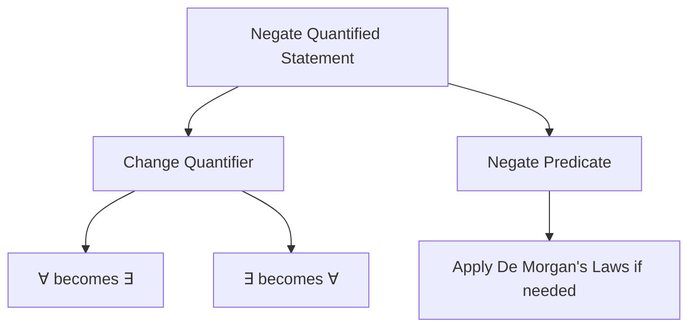

# Negation of Quantified Statements

> **Course:** Discrete Structures  
> **Unit:** 1 – Set Theory and Logic

---

## Table of Contents

- [Learning Objectives](#learning-objectives)
- [Introduction](#introduction)
- [Why Negate Quantified Statements?](#why-negate-quantified-statements)
- [Negation of Universal Quantifier](#negation-of-universal-quantifier)
- [Negation of Existential Quantifier](#negation-of-existential-quantifier)
- [General Rules](#general-rules)
- [Negating Compound Statements](#negating-compound-statements)
- [Solved Examples](#solved-examples)
- [Applications](#applications)
- [Exam Focus](#exam-focus)
- [Common Mistakes](#common-mistakes)
- [Quick Revision](#quick-revision)
- [Practice Questions](#practice-questions)
- [Summary](#summary)

---

# Learning Objectives

After studying this chapter, you should be able to:

- Negate universally quantified statements.
- Negate existentially quantified statements.
- Apply De Morgan's Laws to quantified expressions.
- Translate English statements into their logical negations.
- Avoid common mistakes while changing quantifiers.

---

# Introduction

In predicate logic, we often need to determine the **opposite (negation)** of a quantified statement.

Unlike propositional logic, negating a quantified statement requires **changing both the quantifier and the predicate**.

For example,

```text
All students passed.
```

Its negation is **not**

```text
All students did not pass.
```

Instead, it is

```text
At least one student did not pass.
```

This change is made using the rules for negating quantifiers.

---

# Why Negate Quantified Statements?

Negation is useful in:

- Mathematical proofs
- Proof by contradiction
- Computer algorithms
- Formal verification
- Database queries
- Logic programming

---

# Negation of Universal Quantifier

A universal statement claims that **every** element satisfies a property.

General form:

```text
∀x P(x)
```

Read as:

> For every x, P(x) is true.

### Negation Rule

```text
¬(∀x P(x))
=
∃x ¬P(x)
```

Meaning:

> There exists at least one element for which P(x) is false.

---

## Example

Statement:

```text
∀x ∈ N

x > 0
```

Negation:

```text
∃x ∈ N

x ≤ 0
```

---

# Negation of Existential Quantifier

An existential statement claims that **at least one** element satisfies a property.

General form:

```text
∃x P(x)
```

Read as:

> There exists an x such that P(x) is true.

### Negation Rule

```text
¬(∃x P(x))
=
∀x ¬P(x)
```

Meaning:

> Every element fails to satisfy P(x).

---

## Example

Statement:

```text
∃x ∈ N

x < 0
```

Negation:

```text
∀x ∈ N

x ≥ 0
```

---

# General Rules

| Original Statement | Negation |
|--------------------|----------|
| `∀x P(x)` | `∃x ¬P(x)` |
| `∃x P(x)` | `∀x ¬P(x)` |

### Memory Trick

```text
∀  ↔  ∃
```

Whenever you negate a quantified statement:

1. Change the quantifier.
2. Negate the predicate.

---

# Negating Compound Statements

When the predicate itself contains logical connectives, apply **De Morgan's Laws**.

## Example 1

Statement:

```text
∀x (P(x) ∧ Q(x))
```

Negation:

```text
∃x (¬P(x) ∨ ¬Q(x))
```

---

## Example 2

Statement:

```text
∃x (P(x) ∨ Q(x))
```

Negation:

```text
∀x (¬P(x) ∧ ¬Q(x))
```

---

# Mermaid Summary



---

# Solved Examples

## Example 1

Negate:

```text
∀x

x is even
```

### Solution

```text
∃x

x is not even
```

---

## Example 2

Negate:

```text
∃x

x > 100
```

### Solution

```text
∀x

x ≤ 100
```

---

## Example 3

Negate:

```text
∀x

(x > 5)
```

### Solution

```text
∃x

(x ≤ 5)
```

---

## Example 4

Negate:

```text
∃x

(x² = 9)
```

### Solution

```text
∀x

(x² ≠ 9)
```

---

# Applications

Negation of quantified statements is used in:

- Mathematical proofs
- Proof by contradiction
- Automated theorem proving
- Artificial Intelligence
- Database systems
- Compiler design
- Formal verification

---

# Exam Focus

⭐ Frequently asked exam questions:

- Negate a universally quantified statement.
- Negate an existentially quantified statement.
- Apply De Morgan's Laws to quantified expressions.
- Translate English statements into symbolic form and negate them.

---

# Common Mistakes

❌ Only changing the predicate.

Wrong:

```text
∀x P(x)

↓

∀x ¬P(x)
```

Correct:

```text
∀x P(x)

↓

∃x ¬P(x)
```

---

❌ Forgetting to negate comparison operators.

Examples:

| Original | Negation |
|----------|----------|
| `>` | `≤` |
| `<` | `≥` |
| `=` | `≠` |
| `≥` | `<` |
| `≤` | `>` |

---

❌ Forgetting De Morgan's Laws.

Remember:

```text
¬(P ∧ Q)
=
¬P ∨ ¬Q
```

```text
¬(P ∨ Q)
=
¬P ∧ ¬Q
```

---

# Quick Revision

## Negation Rules

```text
¬(∀x P(x))
=
∃x ¬P(x)
```

```text
¬(∃x P(x))
=
∀x ¬P(x)
```

### Steps

1. Change the quantifier.
2. Negate the predicate.
3. Apply De Morgan's Laws if necessary.

---

# Practice Questions

## Theory

1. State the rules for negating quantified statements.
2. Why must the quantifier change during negation?
3. Explain the role of De Morgan's Laws in predicate logic.

---

## Problems

Negate the following statements:

1.

```text
∀x

x > 2
```

2.

```text
∃x

x² = 16
```

3.

```text
∀x

(P(x) ∨ Q(x))
```

4.

```text
∃x

(P(x) ∧ Q(x))
```

---

# Summary

- Negating a quantified statement requires changing the quantifier and negating the predicate.
- Universal quantifiers (`∀`) become existential quantifiers (`∃`).
- Existential quantifiers (`∃`) become universal quantifiers (`∀`).
- De Morgan's Laws are used when the predicate contains logical connectives.
- This topic is essential for mathematical proofs and logical reasoning.

---

## End of Unit 1

Congratulations! 🎉 You have completed **Unit 1 – Set Theory and Logic**.

**Next Unit:** ➡️ **Unit 2 – Functions, Relations, and Recurrence Relations**